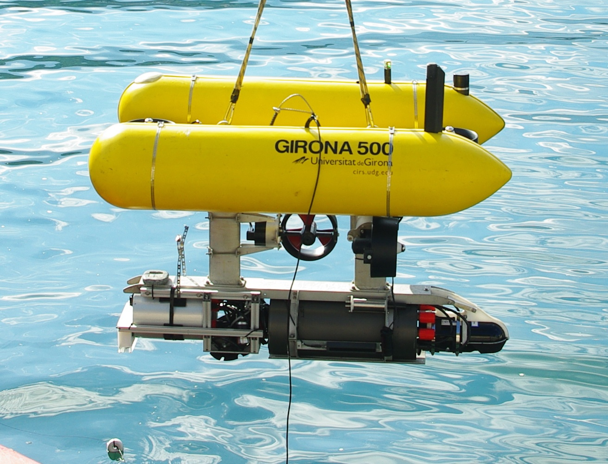

.. role:: raw-tex(raw)
  :format: latex html
.. role:: raw-math(raw)
  :format: latex html

Visual Odometry for Autonomous Underwater Vehicles
==================================================
| *Stephan Wirth*
| *Universitat de les Illes Balears*
| *stephan.wirth@uib.es*

| *Pep Lluís Negre Carrasco*
| *Universitat de les Illes Balears*
| *pepllu.negre@gmail.com*

Introduction
------------
Vision based localization, mapping and motion estimation algorithms are widely used in ground-based and aerial robotics. They have proven to be a precise and low-cost alternative to inertial measurement units and laser scanners. In this paper we show that vision based odometry can be used by autonomous underwater vehicles (AUVs) that navigate close to the seabed for incremental pose estimation and 3D reconstruction of small areas. We present the integration of a stereo visual odometry system into two AUVs. Furthermore we present experiments carried out in laboratory and harbour conditions comparing vision based pose estimates with ground truth and DVL measurements.

Visual Odometry System
----------------------
The first choice to make for setting up a visual odometry system is the type of cameras to use. For a stereo camera system, one can choose between a fixed system that contains two cameras in one case and a custom made system of two single cameras. While the latter is more flexible as one can adapt the baseline the former is easier to integrate as synchronization and alignment are optimized by the manufacturer.
We use a standard stereo camera with a custom waterproof housing.
The visual odometry software we choose is based on *libviso2* :raw-tex:`\cite{Geiger2011}`. The processing pipeline contains five consecutive steps:

1. Image Acquisition
2. Preprocessing
3. Feature Extraction
4. Feature Matching
5. Motion Estimation

*libviso2* covers steps 3 to 5. We added an open source wrapper for this library [#]_ to integrate it into the Robot Operating System ROS :raw-tex:`\cite{Quigley2009}`. This simplifies the integration in different robotic vehicles as well as comparison with other integrated sensors. For step 2 we use the OpenCV library :raw-tex:`\cite{Bradski2000}` functions that are integrated in ROS and step 1 is done by a custom stereo camera driver.

.. [#] See http://www.ros.org/viso2_ros for source code and documentation.

.. Image Acquisition

.. The design of the stereo system determines the precision of the overall system. Generally speaking, higher resolution, greater field of view and greater baseline improve precision. However, increasing resolution increases processing time as well, greater field of view reduces details and a greater baseline can lead to matching problems as the scene may look different from left and right camera positions. We formally present these variables and the dependencies on the environment.

.. Preprocessing

.. The first step of working with stereo images is undistortion and rectification. After this process, corresponding points of left and right images lie on the same line.

.. Feature Extraction

.. Feature extraction is done by applying blob and corner detection masks on the image. The result is a huge amount of features of four classes. Non-minimum and non-maximum suppression is used for filtering.

..  Matching

.. The feature matching 

..  Motion Estimation

Evaluation Method
-----------------

As visual odometry suffers from drift, comparing whole trajectories, i.e. poses in time directly to ground truth is not very meaningful. Instead, we subdivide the path into small pieces and compare relative transformations for each piece to the matching piece in our ground truth. We evaluate translation and rotation error for every degree of freedom.

Experiment Results
--------------------

The experiments carried out use data gathered during the TRIDENT project [#]_ both in laboratory and harbour conditions using the Girona500 AUV :raw-tex:`\cite{Ribas2012}` as vehicle. Ground truth for the laboratory experiment is extracted by matching each image that has been captured against the known image that is printed on the floor of the test pool.
For the harbour experiment, the determination of ground truth is more difficult, as no external sensors have been used and positions of natural landmarks are not known. One aim of the project was the construction of a consistent seabed mosaic. The computation of this mosaic includes global optimization of all camera poses. The resulting trajectory does not suffer from drift and is therefore chosen as our ground truth reference.

.. [#] see http://www.irs.uji.es/trident/

  
  The Girona 500 AUV during the harbour experiments. The white box in the front of the lower part is the stereo camera. The cylinder right next to it contains the image processing unit.

.. CIRS Lab
.. ^^^^^^^^

.. Roses Harbour
.. ^^^^^^^^^^^^^

.. 3D Reconstruction
.. ^^^^^^^^^^^^^^^^^

Conclusion
----------

- Not suitable for long term pose estimation due to drift and possible failure, but as aid for information filter
- Very good rotation estimates for rotations around the optical axis
- Highest errors in pitch and roll estimation (as expected)
- Useful for online (!) 3D reconstruction of small areas

.. raw:: latex

  \bibliographystyle{plain}
  \bibliography{references}
